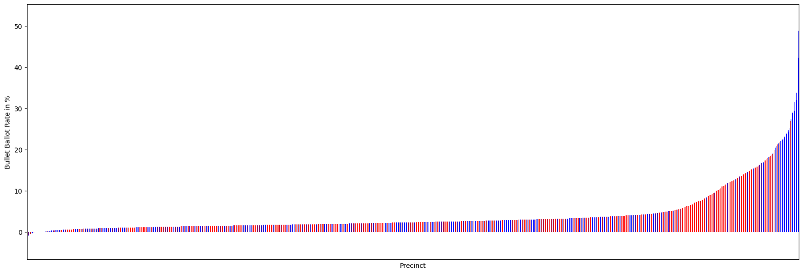
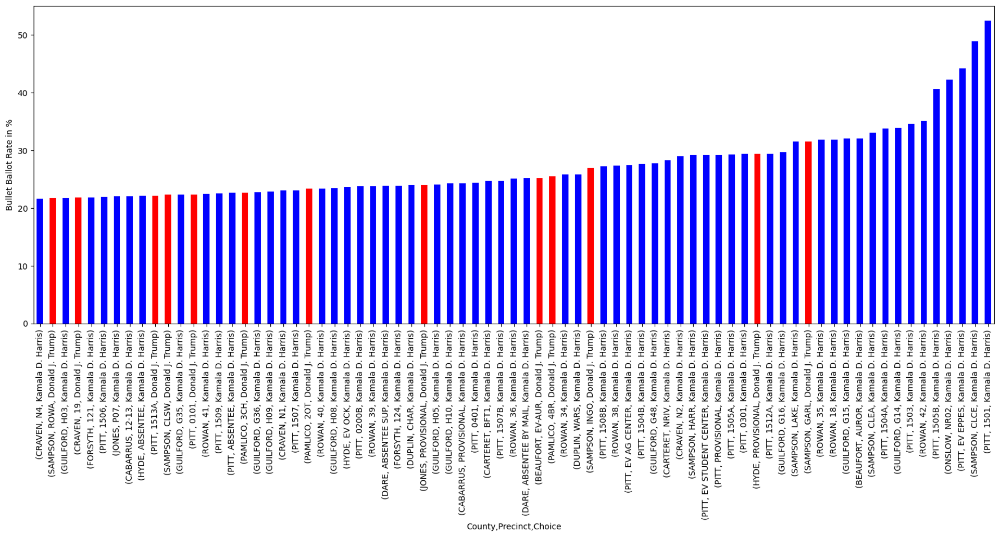
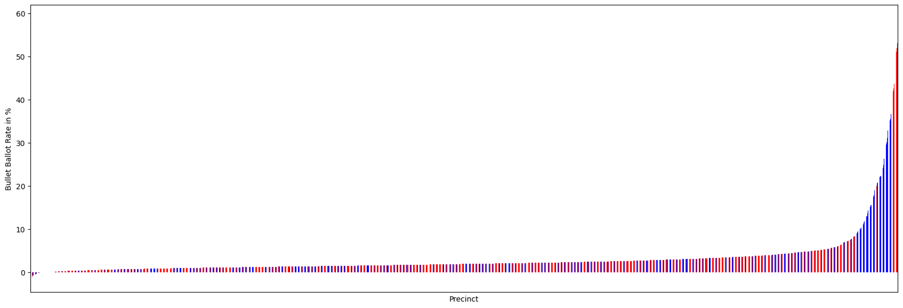
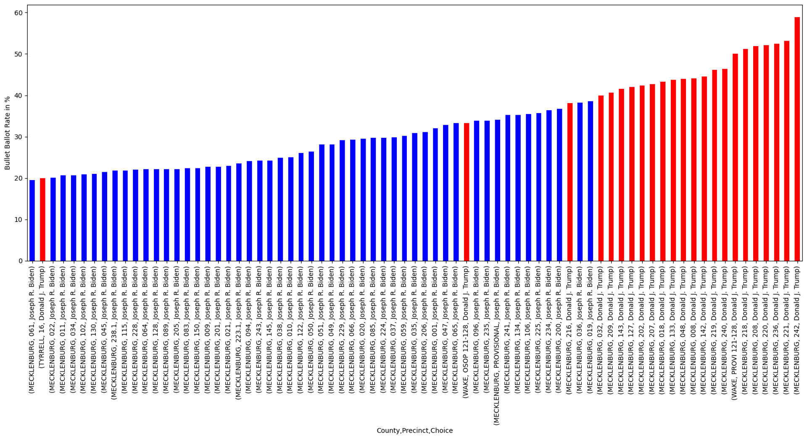

# Analysis of Election Results in North Caroline

There have been rumors about suspicious election results in swing states, saying that the number of bullet ballots (only voting for president and leaving everything else blank) was extremely high compared to other elections. In North Carolina these rumors said, that there was a rate of bullet ballots of 11%. This analysis tries to confirm these rumors.

## Results

The distribution of bullet ballots in % for all precincts in North Carolina looks like this:

Zooming into the 50 highest rates:

Whereas the distribution of bullet ballots in % for all precincts in North Carolina 2020 looked like this:

Zooming into 50 highest rates:

It looks like in 2024 the highest rates for bullet ballots occured in precincts that the Democrats have won, while in 2020 this was the case for the Republicans. The average bullet ballot rates were 3.8% and 3.6% for 2024 and 2020, respectively.

## Contribution

I don't guarantee that this analysis is correct and I would be happy for anyone to check this analysis and correct me if I made mistakes.
